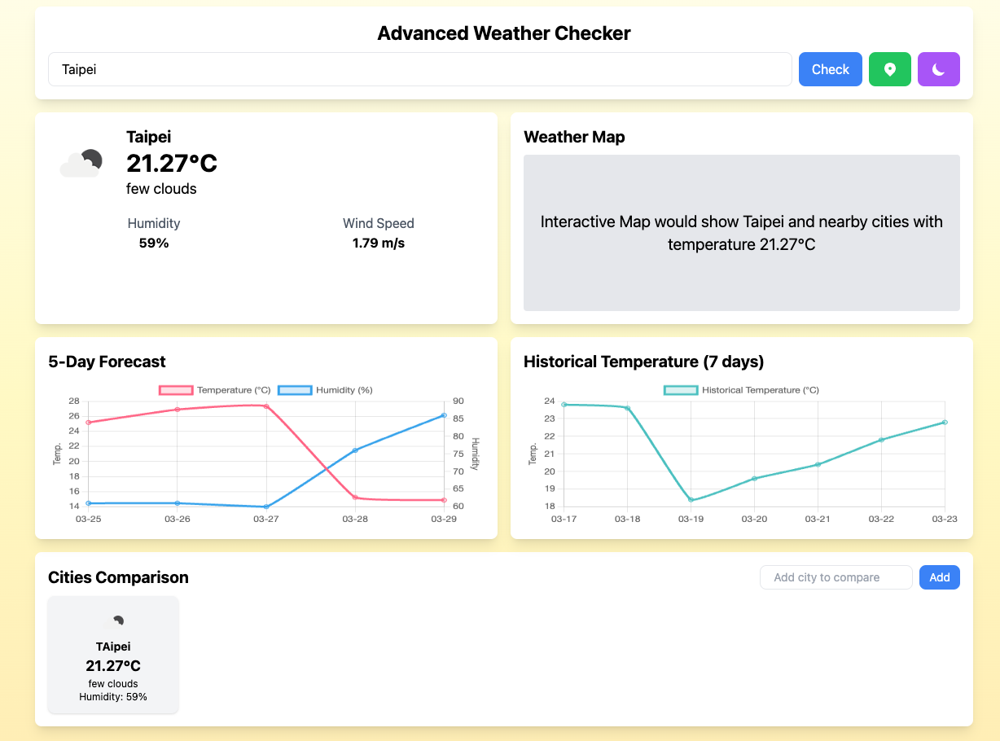
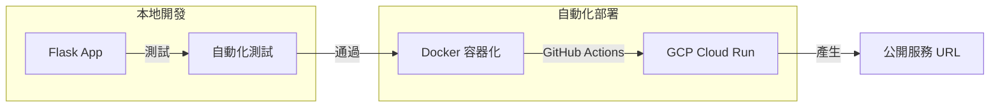

#### 練習：

本地開發＋自動化測試＋ Docker 容器化並透過 GitHub Action 做自動化部署到 GCP

```mermaid
graph LR
    subgraph Local[本地開發]
        A[Flask App] -->|測試| B[自動化測試]
    end

    subgraph Deploy[自動化部署]
        B -->|通過| C[Docker 容器化]
        C -->|GitHub Actions| D[GCP Cloud Run]
    end

    D -->|產生| E[公開服務 URL]

```
